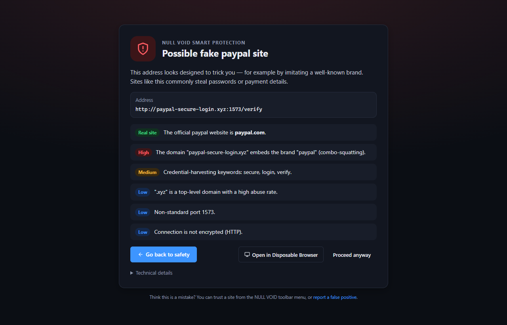
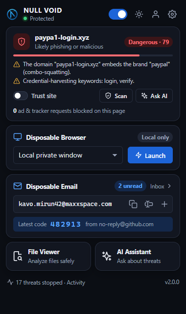
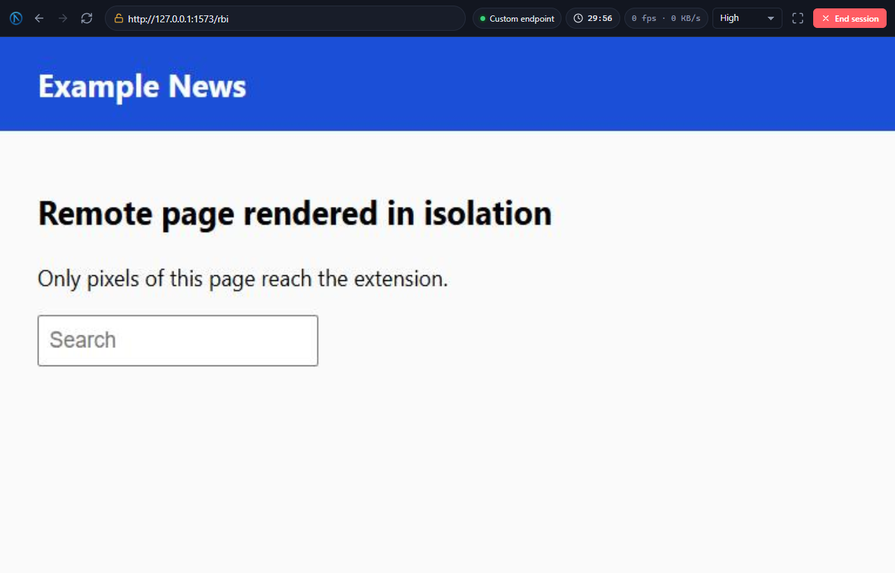
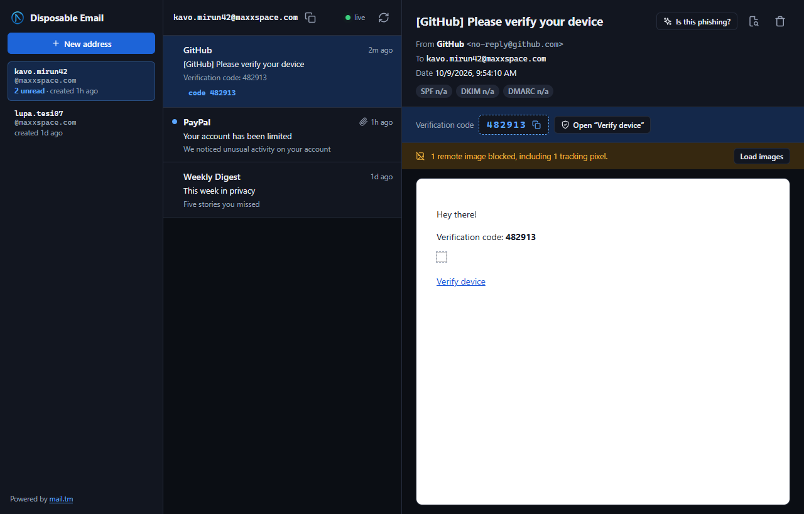
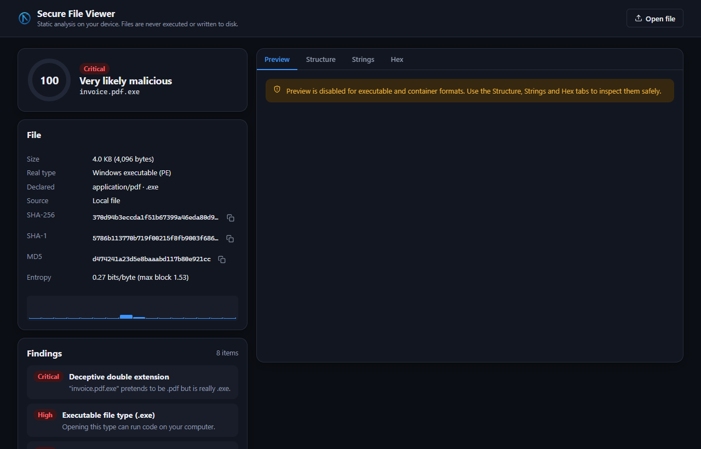
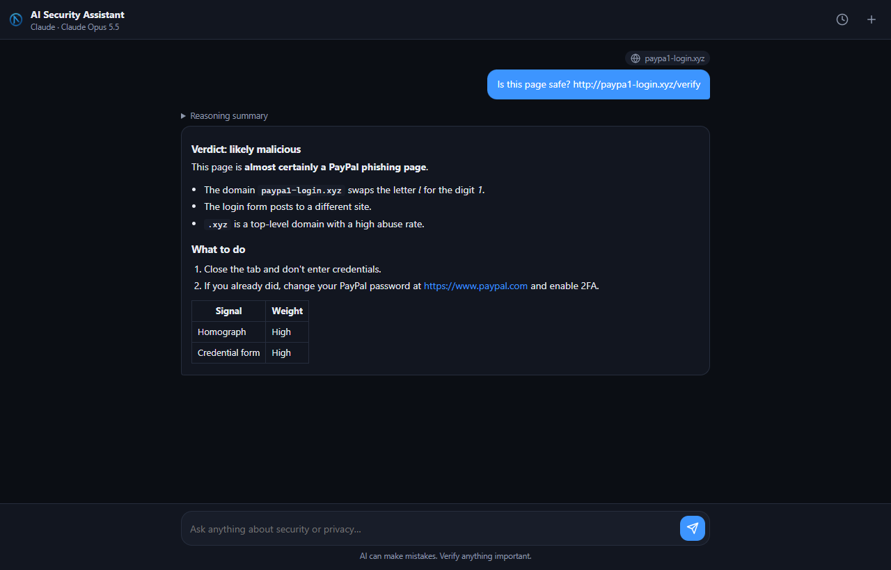

# NULL VOID

<p align="center"></p>

<p align="center"><strong>Security and privacy tools for your browser:</strong> threat blocking, remote browser isolation, disposable e-mail, on-device file analysis and an AI security assistant.</p>

<p align="center">
  
  
  
  
</p>

<p align="center"></p>

---

## Contents

- [Features](#features)
- [Install](#install)
- [Optional setup](#optional-setup)
- [How it works](#how-it-works)
- [Security model](#security-model)
- [Development](#development)
- [Project structure](#project-structure)
- [Privacy](#privacy)
- [Contributing](#contributing) · [License](#license)

---

## Features

### Smart Protection



Runs on every page, using the browser's built-in filtering engine (`declarativeNetRequest`), so blocking adds no page-load overhead.

| Layer | What it does |
| --- | --- |
| **Ad & tracker blocking** | ~40,000 third-party ad, tracking and analytics hosts (StevenBlack/hosts). The toolbar badge shows how many requests were blocked on the current page. |
| **Malware & phishing blocklist** | ~377,000 known-bad hosts (abuse.ch URLhaus + Phishing.Database). Navigations land on a warning page; payload hosts are also blocked for scripts, images and downloads. |
| **Look-alike detection** | On-device scoring of every address: IDN homographs (`аррӏе.com`), digit swaps (`paypa1.com`), typo- and combo-squatting (`paypal-secure-login.xyz`), brands hidden in subdomains, `user@host` tricks, raw IPs, abused TLDs and free hosting. **Balanced** and **Strict** modes. |
| **Credential-phishing checks** | When a page shows a password field, NULL VOID checks whether the form posts to another site, whether the page claims a brand it doesn't belong to, and whether the connection is unencrypted. If so, it shows a warning bar inside the page. |
| **Download guard** | Pauses or blocks executables, scripts, macro documents, disk images, deceptive names (`invoice.pdf.exe`, right-to-left override tricks) and files from risky sources. You review them in a dedicated window. |
| **Threat intelligence** *(optional)* | Google Safe Browsing v5 (privacy-preserving hash-prefix lookups), VirusTotal and abuse.ch, all using your own free keys. Lookups run when you click **Scan**, check a link or analyse a file, or on every navigation if you enable that. |
| **Controls** | Trusted sites, personal blocklist, optional HTTPS upgrade, a "proceed anyway" exception that lasts the session, and an on-device activity log. |

<br clear="right"/>

### Disposable Browser (Remote Browser Isolation)



Opens risky links in a **remote Chromium** and streams only video frames to you. No remote HTML, JavaScript or downloads ever run on your device.

- Works with [Browserless](https://www.browserless.io/) (US West, London and Amsterdam regions; free tier available) or **any self-hosted CDP endpoint**, such as `ghcr.io/browserless/chromium` in Docker.
- Full interaction: mouse, wheel, keyboard, clipboard paste/copy, JavaScript dialogs, back/forward/reload and a URL bar with risk badges.
- Pop-ups fold back into the isolated tab, downloads are denied remotely, and the timezone and locale match the region.
- Adjustable stream quality, live fps and bandwidth, idle and maximum-length timeouts. The stream pauses while the tab is hidden.
- **Local fallback:** a private (incognito) window, or a temporary window whose cookies and storage are wiped on close.

<br clear="right"/>

### Disposable Email

<p align="center"></p>

Throwaway inboxes powered by [mail.tm](https://mail.tm), with up to 10 addresses at once.

- **Live inbox** over Mercure server-sent events, plus background polling with desktop notifications.
- **One-time codes are extracted automatically** and shown in the popup and the notification. Verification links get a one-click button.
- **Safe rendering:** sanitised with DOMPurify inside a script-less sandboxed frame with a strict CSP. Remote images and tracking pixels are blocked by default, and every link goes through the NULL VOID link checker.
- **Sender verification:** SPF / DKIM / DMARC results and spoofing tells such as a mismatched Reply-To.
- Attachments open straight in the Secure File Viewer. One click inserts your disposable address into the page.

### Secure File Viewer



Static analysis on your device. Files are never executed, uploaded or written to disk.

- **Real type from magic bytes**, flagging mismatched extensions, double extensions and bidi-override names.
- PE/ELF/Mach-O headers, packer sections, W+X sections, overlays and entropy maps.
- PDF keyword census in the style of `pdfid` (`/JavaScript`, `/OpenAction`, `/Launch`…), Office macros (`vbaProject.bin`), OLE packages, Equation Editor and RTF exploit artefacts.
- ZIP directory inspection without extraction: Zip-Slip, nested executables, encrypted entries, decompression bombs.
- HTML-smuggling, credential-form and obfuscated-script detection.
- IOC extraction (URLs, IPs, domains, e-mails), SHA-256/SHA-1/MD5, and optional hash reputation on VirusTotal and MalwareBazaar (only the hash is sent).
- **Safe previews:** images re-rendered through a canvas (with a metadata-free "clean copy"), PDFs via PDF.js with scripting disabled, text from DOCX/PPTX/XLSX/ODF, CSV tables, sanitised HTML, media, hex and strings.

<br clear="right"/>

### AI Security Assistant



A side-panel assistant that uses **your own key**: Anthropic Claude (default `claude-opus-5-5`), any OpenAI-compatible endpoint (OpenAI, OpenRouter, Groq, or **local models via Ollama/LM Studio**), or Google Gemini.

- One-click **Analyze this page**, **Is this e-mail phishing?**, **Explain this file report**, and **Ask about selection** from the context menu.
- Streaming Markdown answers (escaped, then sanitised), reasoning summaries and local chat history.
- Prompt-injection hardening: page, e-mail and file content goes into delimited `<untrusted_content>` blocks that are treated as evidence, never as instructions.

<br clear="right"/>

---

## Install

### From source (Chrome, Edge, Brave, Opera, Vivaldi)

1. Download or clone this repository.
2. Open `chrome://extensions` and enable **Developer mode**.
3. Click **Load unpacked** and select the **`src`** folder.

### Firefox (140+)

```bash
npm install
npm run build:firefox
```

Then open `about:debugging#/runtime/this-firefox` → **Load Temporary Add-on…** → `dist/firefox/manifest.json`.
In Firefox, host permissions are opt-in. If the popup asks, click **Grant access** so NULL VOID can protect websites.

---

## Optional setup

Everything except remote isolation, the AI assistant and threat-intel lookups works without configuration. Keys are stored **encrypted on your device** (see [Security model](#security-model)).

| Feature | Where to get a key | Settings section |
| --- | --- | --- |
| Remote isolation | [browserless.io](https://www.browserless.io/) token, or your own CDP endpoint | Disposable Browser |
| AI assistant | [Anthropic](https://console.anthropic.com/settings/keys), any OpenAI-compatible provider, or [Gemini](https://aistudio.google.com/apikey) | AI Assistant |
| Google Safe Browsing | [Google Cloud console](https://developers.google.com/safe-browsing/v4/get-started) | Threat Intelligence |
| VirusTotal | [virustotal.com](https://www.virustotal.com/gui/my-apikey) | Threat Intelligence |
| URLhaus / MalwareBazaar | [auth.abuse.ch](https://auth.abuse.ch/) | Threat Intelligence |

**Self-hosting the remote browser:**

```bash
docker run -p 3000:3000 -e TOKEN=change-me ghcr.io/browserless/chromium
# Settings → Disposable Browser → Custom endpoint: ws://localhost:3000?token=change-me
```

A plain Chrome started with `--remote-debugging-port` also works if you add `--remote-allow-origins=chrome-extension://<your extension id>`. Settings shows the exact origin.

**Keyboard shortcuts:** `Alt+Shift+N` opens the popup and `Alt+Shift+B` opens the Disposable Browser. You can change them at `chrome://extensions/shortcuts`.

---

## How it works

```
┌────────────────────────── Service worker (background/) ───────────────────────────┐
│ router.js      typed message router; content scripts may only call allow-listed     │
│ protection.js  DNR rulesets, trusted/blocked sites, session exceptions, badge       │
│ navigation.js  webNavigation guard → URL heuristics → interstitial redirect         │
│ intel.js       Safe Browsing v5 / VirusTotal / abuse.ch with session cache           │
│ downloads.js   download guard (pause / block / review)                               │
│ email.js       chrome.alarms inbox polling, OTP-aware notifications                  │
│ menus.js       context menus · rbi.js local ephemeral windows · auth.js · page.js    │
└──────────────────────────────────────────────────────────────────────────────────────┘
        ▲ runtime messages                       ▲ static rulesets (rules/*.json)
┌───────┴──────────── Extension pages ──────────────┐   ┌──── content/protect.js ────┐
│ popup · options · blocked (interstitial/link check│   │ cosmetic ad-slot hiding     │
│ /download review) · inbox · viewer · rbi ·        │   │ credential-phishing checks  │
│ assistant (side panel) · auth/callback            │   │ closed Shadow-DOM warning   │
└───────────────────────────────────────────────────┘   └─────────────────────────────┘
                     │ shared, pure ES modules (lib/)
  url-analysis · domain · file-analysis · mailtm · otp · sse · cdp-client · rbi-session
  threat-intel · email-auth · markdown · sanitize · vault · settings · ai/providers
```

- **No build step for development.** `src/` is a working MV3 extension of plain ES modules. Third-party libraries are vendored in `src/vendor` (MV3 forbids remote code).
- **Blocklists** are generated by `npm run rules` from permissively licensed feeds and split into files under 3 MB (the addons.mozilla.org parse limit).
- **Firefox builds** are produced from the same source. `scripts/build.mjs` swaps the service worker for background scripts and `side_panel` for `sidebar_action`, and adds Gecko settings, including the data-collection consent declaration.

### Accessibility

All extension pages meet **WCAG 2.1 AA** in light and dark mode. The E2E suite runs axe-core on every page and fails on any violation. Every control has an accessible name, all text pairs reach 4.5:1 contrast, everything is keyboard-operable (skip link, focus management, Escape to close menus), status changes are announced to screen readers, and animations respect `prefers-reduced-motion`.

---

## Security model

- **No secrets in code.** API keys, tokens and mailbox passwords live in an AES-GCM-encrypted vault in the extension's own IndexedDB. Content scripts run in the web page's origin and cannot read it. Keys are never synced.
- **Strict CSP** on all extension pages (`script-src 'self'`, no `unsafe-eval`, `object-src 'none'`, `base-uri 'none'`, `form-action 'none'`).
- **Untrusted content never executes.** E-mail and HTML previews render in `sandbox`ed, script-less frames with their own CSP. PDFs render through PDF.js 6 with `isEvalSupported: false` (the CVE-2024-4367 mitigation). Images are re-encoded through a canvas. AI output is escaped before it is sanitised.
- **Least-privilege messaging.** The background router rejects messages from other extensions, and web-page content scripts can only call the two handlers they need.
- The warning page refuses to render inside frames, which prevents clickjacking of "Proceed anyway". Its sign-in callback is web-accessible only to the NULL VOID domains.

Found a vulnerability? See [SECURITY.md](SECURITY.md).

---

## Development

Requires Node.js 20+.

```bash
npm install                # dev tooling (ESLint, esbuild, Playwright, web-ext, vendored libs)
npm run lint               # ESLint (flat config)
npm test                   # 62 unit tests (node:test)
npm run test:integration   # remote-browser engine vs. a real headless Chromium over CDP
npm run test:e2e           # 19 end-to-end tests in Chromium via Playwright, incl. axe-core accessibility checks
npm run build              # dist/chrome + dist/firefox + zips
npm run lint:firefox       # Mozilla's web-ext lint on the Firefox build
npm run rules              # refresh the threat blocklists
npm run vendor             # re-copy DOMPurify, PDF.js, fflate, Anthropic SDK into src/vendor
```

The end-to-end suite runs fully offline. `--host-resolver-rules` maps fake phishing and malware hostnames to a local server, a second headless Chromium stands in for Browserless, and mail.tm is mocked. It covers the interstitial and *Proceed*, blocklist redirects, third-party ad blocking, the in-page phishing warning, trusted sites, settings persistence, file analysis and PDF rendering, the download guard, the assistant, the remote browser, and rendering a hostile e-mail.

---

## Project structure

```
src/
  manifest.json            MV3 manifest (Chromium); Firefox variant generated at build time
  background/              service worker modules (see "How it works")
  content/protect.js       page guard content script
  popup/ options/ blocked/ inbox/ viewer/ rbi/ assistant/ auth/   extension pages
  lib/                     shared logic (pure modules are unit-tested in Node)
  ui/                      design tokens (light/dark), icon sprite
  rules/                   generated declarativeNetRequest rulesets + SOURCES.json
  vendor/                  DOMPurify, PDF.js, fflate, Anthropic SDK (+ licenses)
  _locales/en/             store name/description
scripts/                   build, vendor, blocklist generator
tests/unit|integration|e2e
docs/images/               screenshots
```

---

## Privacy

NULL VOID has no servers, collects no telemetry and contains no analytics. Everything stays on your device unless you use a feature that needs a third party, and each of those is listed in [PRIVACY.md](PRIVACY.md).

## Contributing

Bug reports, false-positive reports and pull requests are welcome. See [CONTRIBUTING.md](CONTRIBUTING.md).

## Acknowledgements

[abuse.ch URLhaus](https://urlhaus.abuse.ch/) (CC0) · [Phishing.Database](https://github.com/mitchellkrogza/Phishing.Database) (MIT) · [StevenBlack/hosts](https://github.com/StevenBlack/hosts) (MIT) · [mail.tm](https://mail.tm) · [Browserless](https://www.browserless.io/) · [DOMPurify](https://github.com/cure53/DOMPurify) · [PDF.js](https://github.com/mozilla/pdf.js) · [fflate](https://github.com/101arrowz/fflate) · [Anthropic SDK](https://github.com/anthropics/anthropic-sdk-typescript)

## Support

- Issues: [GitHub Issues](https://github.com/nullvoidweb/nullvoid/issues)
- Contact: contact@anishalx.dev

## License

MIT. See [LICENSE](LICENSE). Bundled third-party components keep their own licenses (`src/vendor/licenses`).
